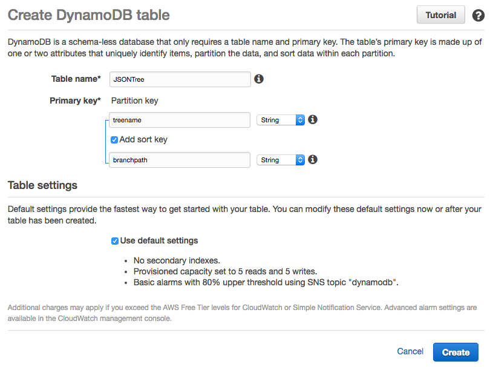
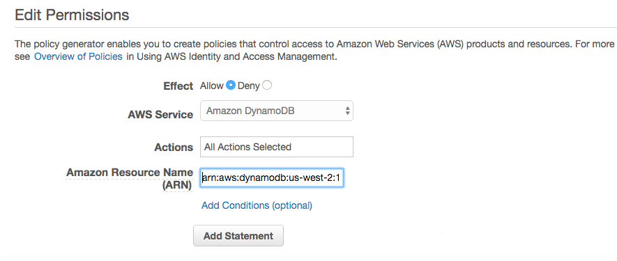

# JSON Tree

JSON Tree is a module for manipulating and querying JavaScript objects.

This becomes easier to do when we treat a [JSON](http://www.json.org/) derived object as a [tree](https://en.wikipedia.org/wiki/Tree_(data_structure)) of branches. That's the basic premise in JSON Tree. However, doing so requires adhering to two simple rules which we'll consider in [Working with JSON Tree](#Working with JSON Tree).

## Table of Contents

* [1. Introduction](#Introduction)
	* [1.1 Method overview](#Method overview)
	* [1.2 Installing JSON Tree](#Installing JSON Tree)
	* [1.3 Test REPL](#Test REPL)
		* [1.3.1 Starting the REPL](#Starting the REPL)
		* [1.3.2 Exiting the REPL](#Exiting the REPL)
		* [1.3.3 Saving your session](#Saving your session)
		* [1.3.4 Loading saved JavaScript files](#Loading saved JavaScript files)
		* [1.3.5 Immediate access to JT](#Immediate access to JT)
* [2. Working with JSON Tree](#Working with JSON Tree)
	* [2.1 Object Format](#Object Format)
	* [2.2 Branch specifiers](#Branch specifiers)
	* [2.3 Loading data into JT](#Loading data into JT)
	* [2.4 Getting a branch](#Getting a branch)
	* [2.5 Appending a branch](#Appending a branch)
	* [2.6 Deleting a Branch](#Deleting a Branch)
	* [2.7 Moving a Branch](#Moving a Branch)
	* [2.8 Branch paths - revisited](#Branch paths - revisited)
* [3. Querying JSON Tree](#Querying JSON Tree)
	* [3.1 Querying with the dot operator](#Querying with the dot operator)
	* [3.2 Querying with the array operator](#Querying with the array operator)
    * [3.3 Querying with predicates](#Querying with predicates)
* [4. Offline storage](#Offline storage)
	* [4.1 Simple storage cases](#Simple storage cases)
	* [4.2 Working with a larger JSON document](#Working with a larger JSON document)
		* [4.2.1 Relational databases](#Relational databases)
		* [4.2.2 NoSQL stores - Redis](#NoSQL stores - Redis)
			* [4.2.2.1 Storing a JSON Tree](#Storing a JSON Tree)
			* [4.2.2.2 Loading and restoring a JSON Tree](#Loading and restoring a JSON Tree)
			* [4.2.2.3 A breakdown of the load technique](#A breakdown of the load technique)
		* [4.2.3 NoSQL Stores - AWS DynamoDB](#NoSQL Stores - AWS DynamoDB)
			* [4.2.3.1 Getting started with DynamoDB](#Getting started with DynamoDB)
			* [4.2.3.2 Storing Tree data in DynamoDB](#Storing Tree data in DynamoDB)
			* [4.2.3.3 Loading Tree data from DynamoDB](#Loading Tree data from DynamoDB)

<a name="Introduction"></a>   
## 1. Introduction

Treating a JavaScript object as a tree offers some advantages - otherwise why do this - right? ;-)

Two key benefits come to mind:

1. Loading JSON data and adding, removing, moving and merging data within the document becomes possible using simple, easy to use, module methods. This process in turn becomes less error prone than writing and duplicating the same dedicated code.
2. Querying JSON documents becomes both easier to do and far more expressive.

The first use-case supports creating a flexible data structure which can be maintained by an application. In front-end applications, the JSON-tree can be stored in the browser's local or session storage.  Within backend applications and services, the JSON tree can be stored in NoSQL data stores such as MongoDB, CouchBase and Redis. Once loaded back into an application it can be further manipulated and queried during the course of the application's usage.

The second use-case allows the JSON data to be query-able without the need for an immediate database engine. This is because common operations can be performed using JSON Tree alone.

There is an important benefit when used with API servers and services.

> Allowing the caller to specify JSON query strings in the API and message requests results in on-demand data payloads that can be considerably smaller and more efficient to transmit and store.

Consider:

```
http://server/user?query='filters.music.favorite.artists'
http://server/library?query='.books{.price < 16}'
```

<a name="Method overview"></a>
## 1.1 Method overview

JSON Tree exposes a collection of methods which are organized under four general categories: `Tree`, `Branch`, `Query` and `Utility`.

Category | Command | Description
--- | --- | ---
`Tree` | setTree | Sets the root tree
 | getTree | Retrieves the internal tree
 | exportTree | Exports the tree into an array of elements suitable for serialization in external stores
`Branch` | appendBranch | Appends a branch at the specified path
 | getBranches | Retrieves an array of branch segments
 | getBranch |  Attempts to find a brach path
 | deleteBranch | Remove a branch based on path
 | moveBranch | Moves (relocates) a branch to another branch location
`Query` | query | Queries document tree or a specific branch
---
Category | Command | Description
--- | --- | ---
`Utility` | getTreeName | Retrieves the name of the tree
 | getPathName | Retrieves the name of a path
 | getPathPrefix | Retrieves the text which precedes the path name
 | load | Loads a JSON file, returns an object
 | prettyFormat | Formats JSON in a pretty string format
 | prettyPrint |  Pretty Prints JSON data to the console

Most of the Utility methods are only useful for debugging. However, we'll look at the use of each of these methods throughout this document.

<a name="Installing JSON Tree"></a>
### 1.2 Installing JSON Tree

JSON Tree is a node module and can be installed using:

```shell
$ npm install
```

<a name="Test REPL"></a>
### 1.3 Test REPL

As we saw in the table earlier, JSON Tree comes with a dozen or so methods. Getting to know how they work can take a bit of effort.  To make this easier, a custom [REPL](https://e n.wikipedia.org/wiki/Read%E2%80%93eval%E2%80%93print_loop) for playing with JSON Tree. This REPL can be an invaluable tool when it comes to using the query capability.  Simply try your queries interactively before embedding them in your projects.

> `TIP`: examples featured in this document can be cut and pasted into the REPL. Don't be afraid to follow along.

Also:
> `Note`: many of the examples in this document are formatted as single line statements. This is great for cutting and pasting - but not that easy on the eyes.  If a particular statement is hard to follow, just paste it into an online [JavaScript Beautifier](http://jsbeautifier.org) or [JavaScript Formatter](http://www.javascriptformat.com) for better viewing.

Keep in mind that the custom REPL is just a wrapper over the NodeJS REPL.  So you can use a few dot commands which are already built-in. Also, don't forget you can use the up and down arrows to move between previously entered commands.

You'll also be able to interact with a preloaded instance of JSON Tree.

<a name="Starting the REPL"></a>
#### 1.3.1 Starting the REPL

```shell
$ node repl.js
➤
```

or

```shell
$ npm start
➤
```

<a name="Exiting the REPL"></a>
#### 1.3.2 Exiting the REPL

To exit the REPL, just enter the dot command `.exit` at the prompt.

```shell
➤ .exit
```

<a name="Saving your session"></a>
#### 1.3.3 Saving your session

You can save your session to an external file, using the `.save` command.  This is useful when you want to save time by later loading a prior session as a starting point for continued experimentation.

```shell
➤ .save session.js
```

Once saved you can use your favorite text editor to cleanup the exported file.

<a name="Loading saved JavaScript files"></a>
#### 1.3.4 Loading saved JavaScript files

The `.load` command can be used to load external JS scripts.

```shell
➤ .load tests/test.js
```

> `Tip`: The REPL  `.load` command is used for loading `JavaScript` files. Be careful not to confuse it with the JSON Tree `load` method which is used for loading `JSON` files.

<a name="Immediate access to JT"></a>
#### 1.3.5 Immediate access to JT

Upon loading,  the custom REPL also loads an instance of JSON Tree  into the session.

```shell
➤ jt
IJSONTree { tree: {}, branchSegments: [] }
```

> `Note`: IJSONTree refers to an: Interface to a JSON Tree module. It appears that way because of how JSON Tree is internally implemented. Ignore the man behind the curtain.

<a name="Working with JSON Tree"></a>
## 2. Working with JSON Tree

Before we get started, it's important to understand two important JT concepts: `Object Format` and `Branch Specifiers`. These are the two rules discussed at the start of this document.

<a name="Object Format"></a>
### 2.1 Object Format (Rule 1)

When used with JSON Tree, JavaScript objects need to be in a specific format:

```javascript
{
  "gear": {
    "cameras": {
      "sony": [
        "a65",
        "a77",
        "rx100M2"
      ]
    }
  }
}
```

In the example above we have an object which contains a single named key which in-turn contains an object. In the case above it's called `gear`. JSON Tree requires this format because it makes it clear what the object's name is.  This also helps avoid the use of special key names where an object name would be specified.  As we'll see later, this rule / requirement has other benefits.

***That is our first rule***

<a name="Branch specifiers"></a>
### 2.2 Branch specifiers (Rule 2)

Navigating within a  tree requires the use of a branch specifier. For example, in order to append data to a branch you have to know how to specify the target branch.

In our last example we might want to work with the `cameras` object.  We can specify this using: `cjus:34/gear/cameras`.  The `getBranches` method returns an array of branch specifiers:

```javascript
➤ jt.getBranches()
[ 'user:34',
  'user:34/profile',
  'user:34/music',
  'user:34/music/favorites',
  'user:34/gear',
  'user:34/gear/cameras',
  'user:34/gear/computers' ]
```

The only requirement, when specifying a branch is that the branch path lead directly to an object.  So, you can't reference a non-object such as an array, number or string.

***This is the second rule.***

The reason for this is that branch paths lead to tree nodes which may themselves contain key / values.  This helps keep tree manipulation clear, as you can't attach an object to to a key value pair, such as a number or string.

<a name="Loading data into JT"></a>
### 2.3 Loading data into JSON Tree

```javascript
➤ var obj = jt.load('tests/test.json');
➤ jt.setTree(obj);
```

Note that our `test/test.json` file adheres to the rule that an object used with JT must be an object with a single named root object.  We can confirm this using:

```javascript
➤ jt.prettyPrint( jt.getTree() )
{
  "user:34": {
    "id": 34,
    "profile": {
      "firstName": "Carlos",
      "lastName": "Justiniano",
      "homeState": "NY",
      "homeCity": "Bronx"
    },
    "computers": {
      "models": [
        {
          "name": "vic20",
          "year": 1981
        },
        {
          "name": "trs-80",
          "year": 1983
        }
      ]
    },
    "music": {
      "favorites": {
        "artists": [
          "Armin Van Buuren",
          "Paul Oakenfold",
          "Led Zeppelin",
          "New Order",
          "Spanish Harlem Orchestra"
        ],
        "styles": [
          "Techno",
          "Rock",
          "Latin"
        ]
      }
    }
  }
}
```

<a name="Getting a branch"></a>
### 2.4 Getting a branch

You can retrieve a branch using the `getBranch` method.

```javascript
➤ var music = jt.getBranch('user:34/music');
➤ music
{ favorites:
   { artists:
      [ 'Armin Van Buuren',
        'Paul Oakenfold',
        'Led Zeppelin',
        'New Order',
        'Spanish Harlem Orchestra' ],
     styles: [ 'Techno', 'Rock', 'Latin' ] } }

➤ music.favorites.styles
[ 'Techno', 'Rock', 'Latin' ]
```

This is useful when you want to work with a branch using plan JS.

```javascript
➤ var music = jt.getBranch('user:34/music');
➤ var styles = music.favorites.styles;
➤ styles.push('Classical');
➤ music
{ favorites:
   { artists:
      [ 'Armin Van Buuren',
        'Paul Oakenfold',
        'Led Zeppelin',
        'New Order',
        'Spanish Harlem Orchestra' ],
     styles: [ 'Techno', 'Rock', 'Latin', 'Classical' ] } }
```

<a name="Appending a branch"></a>
### 2.5 Appending a branch

Let's append data to our JSON Tree using the `appendBranch`method.

```javascript
➤ var gear = jt.load('tests/gear.json');

➤ gear
{ gear: { cameras: { apple: [Object], sony: [Object] } } }

➤ jt.appendBranch('user:34', gear);
true
```

So the last statement above says: append the `gear` object to the branch specified by the branch path `user:34`

We can review the results of this using the `getTree` method.

```javascript
➤ jt.getTree();
{ 'user:34':
   { id: 34,
     profile:
      { firstName: 'Carlos',
        lastName: 'Justiniano',
        homeState: 'NY',
        homeCity: 'Bronx' },
     computers: { models: [Object] },
     music: { favorites: [Object] },
     gear: { cameras: [Object] } } }
```

We can also see this in a prettier format:

```javascript
➤ jt.prettyPrint( jt.getTree() );
```

<a name="Deleting a Branch"></a>
### 2.6 Deleting a Branch

Given the output of the last example, let's try deleting a branch.

```javascript
➤ jt.deleteBranch('user:34/profile');
true

➤ jt.getTree();
{ 'user:34':
   { id: 34,
     computers: { vic20: [Object], 'trs-80': [Object] },
     music: { favorites: [Object] },
     gear: { cameras: [Object] } } }
```

Notice that the `profile` branch no longer exists.  Don't worry, this doesn't change the data stored on disk.  Only the JT internal tree is being manipulated.

<a name="Moving a Branch"></a>
### 2.7 Moving a Branch

We can move a branch from one location to another.  Let's try this by moving the  branch  `user:34/computers` to the `user:34/gear` branch. This makes sense right? After all, computers are gear right?

```javascript
➤ jt.moveBranch('user:34/computers', 'user:34/gear');
true

➤ jt.getTree()
{ 'user:34':
   { id: 34,
     music: { favorites: [Object] },
     gear: { cameras: [Object], computers: [Object] } } }
```

<a name="Branch paths - revisited"></a>
### 2.8 Branch paths - revisited

As we've seen, branch paths are a convenient way of specifying branches within JSON Tree.

Again, to see a list of branches you can always use the aptly named `getBranches()` method:

```javascript
➤ jt.getBranches();
[ 'user:34',
  'user:34/profile',
  'user:34/music',
  'user:34/music/favorites',
  'user:34/gear',
  'user:34/gear/cameras',
  'user:34/gear/computers' ]
```

<a name="Querying JSON Tree"></a>
## 3. Querying JSON Tree

JSON Tree can be queried using a branch path and a query string. Under the hood, JSON Tree uses [JSPath](https://github.com/dfilatov/jspath), a domain-specific language (DSL) "that enables you to navigate and find data within your JSON documents." Make sure to visit that project to learn more than we'll examine here.

> `Note:` at this time JSON Tree doesn't support the JSPath use of substitutions.

For the next set of exercises, lets begin by reloading JT's tree using different data:

```javascript
➤ var data = jt.load('tests/library.json');
➤ jt.setTree(data);
➤ jt.getTree();
{ library: { books: [ [Object], [Object], [Object], [Object] ] } }
```

<a name="Querying with the dot operator"></a>
### 3.1 Querying with the dot operator

You can query JSON Tree using the same syntax, which is similar to the Javascript dot operator.  The first parameter to the `query` method is the branch selector, in our case `library` and the second parameter is the query string.

```javascript
➤ jt.query('library', '.books.author');
[ { name: 'Robert C. Martin' },
  { name: 'Nicholas C. Zakas' },
  { name: 'Robert C. Martin' },
  { name: 'Douglas Crockford' } ]
```

Notice that we got back all of the records and not just one. The reason is that the `.books.author` query reads as get ***all*** authors.

Before moving on, remember: we can't use `library/books` as a branch selector because branch selectors must point to objects, and in our case `books` is an array. See Rule 1 at [Object Format](#Object Format) for reasons why.

```javascript
➤ jt.query('library/books', '.author');
null
```

Similarly, we can retrieve all the book authors:

```javascript
➤ jt.query('library', '.books.author.name');
[ 'Robert C. Martin',
  'Nicholas C. Zakas',
  'Robert C. Martin',
  'Douglas Crockford' ]
```

We can retrieve the book titles in one of two ways:

```javascript
➤ jt.query('library', '.books.title')
[ 'Clean Code',
  'Maintainable JavaScript',
  'Agile Software Development',
  'JavaScript: The Good Parts' ]

➤ jt.query('library', '.books..title')
[ 'Clean Code',
  'Maintainable JavaScript',
  'Agile Software Development',
  'JavaScript: The Good Parts' ]
```

Take a close look, the only difference is the use of the `..` operator, which is useful for descending into data.

<a name="Querying with the array operator"></a>
### 3.2 Querying with the array operator

If you know the array position of a entry you can retrieve it using:

```javascript
➤ jt.query('library', '.books[0].title');
[ 'Clean Code' ]
```
You can also retrieve the last array entry:

```javascript
➤ jt.query('library', '.books[-1].title');
[ 'JavaScript: The Good Parts' ]
```

The negative syntax above is common in languages such as Python and Ruby.

You can also retrieve the two book titles starting from the second position.

```javascript
➤ jt.query('library', '.books[1:3].title');
[ 'Maintainable JavaScript', 'Agile Software Development' ]
```

Here's a way of retrieving the last three titles:

```javascript
➤ jt.query('library', '.books[-3:].title');
[ 'Maintainable JavaScript',
  'Agile Software Development',
  'JavaScript: The Good Parts' ]
```

<a name="Querying with predicates"></a>
### 3.3 Querying with predicates

A common pattern for querying is locating information based on an id value.  We can do this via JSON Tree using predicates:

```javascript
➤ jt.query('library', '.books{.id === 4}');
[ { id: 4,
    title: 'JavaScript: The Good Parts',
    author: { name: 'Douglas Crockford' },
    price: 15.67 } ]
```

We can also retrieve all the books except for `JavaScript: The Good Parts`:

```javascript
➤ jt.query('library', '.books{.id !== 4}');
[ { id: 1,
    title: 'Clean Code',
    author: { name: 'Robert C. Martin' },
    price: 17.96 },
  { id: 2,
    title: 'Maintainable JavaScript',
    author: { name: 'Nicholas C. Zakas' },
    price: 10 },
  { id: 3,
    title: 'Agile Software Development',
    author: { name: 'Robert C. Martin' },
    price: 20 } ]
```

> `Tip`: when working with predicates keep in mind that JavaScript rules do apply around [equality](http://www.2ality.com/2011/06/javascript-equality.html) comparisons... so `==` and `===` are not the same thing.

Here we'll query for all the books under $16 dollars:

```javascript
➤ jt.query('library', '.books{.price < 16}');
[ { id: 2,
    title: 'Maintainable JavaScript',
    author: { name: 'Nicholas C. Zakas' },
    price: 10 },
  { id: 4,
    title: 'JavaScript: The Good Parts',
    author: { name: 'Douglas Crockford' },
    price: 15.67 } ]
```

We can also retrieve selective data based on a query.  Here we're interested in the authors of all books priced over 15 dollars. Note that the predicate portion `{.price > 15}` has `.author` appended.

```javascript
➤ jt.query('library', '.books{.price > 15}.author');
[ { name: 'Robert C. Martin' },
  { name: 'Robert C. Martin' },
  { name: 'Douglas Crockford' } ]
```

Notice how the response include `Robert C. Martin` twice. That's because he has two books (`Clean Code` and `Agile Software Development`) which are both priced over $15 dollars.

With a slightly more complex query we can specify that we're not interested in the Agile development book.

```javascript
➤ jt.query('library', '.books{.price > 15 && .title !== "Agile Software Development"}.author');
[ { name: 'Robert C. Martin' }, { name: 'Douglas Crockford' } ]
```

And we can confirm this with:

```javascript
➤ jt.query('library', '.books{.price > 15 && .title !== "Agile Software Development"}.title');
[ 'Clean Code', 'JavaScript: The Good Parts' ]
```

To learn more about what's possible, make sure to visit the [JSPath](https://github.com/dfilatov/jspath) site.

<a name="Offline storage"></a>
## 4. Offline storage

So far we've looked at how JSON Tree can be used in an in memory manor.  Adding, moving, deleting and querying JSON Tree entries are all easy to do.  But what about storing tree data between usages?

<a name="Simple storage cases"></a>
### 4.1 Simple storage cases

If the data you're working with is relatively small then simply serializing the JSON Tree will suffice. This is useful when working in a web front-end and relying on the browser's local or session storage.

```javascript
➤ var serialized = JSON.stringify( jt.getTree() );

➤ serialized
'{"user:34":{"id":34,"profile":{"firstName":"Carlos","lastName":"Justiniano","homeState":"NY","homeCity":"Bronx"},"music":{"favorites":{"artists":["Armin Van Buuren","Paul Oakenfold","Led Zeppelin","New Order","Spanish Harlem Orchestra"],"styles":["Techno","Rock","Latin"]}},"gear":{"cameras":{"apple":["iPhone 6s"],"sony":["a65","a77","rx100M2"]},"computers":{"models":[{"name":"vic20","year":1981},{"name":"trs-80","year":1983}]}}}}'
```

Later we can simply reload the serialized data:

```javascript
➤ var serialized = '{"user:34":{"id":34,"profile":{"firstName":"Carlos","lastName":"Justiniano","homeState":"NY","homeCity":"Bronx"},"music":{"favorites":{"artists":["Armin Van Buuren","Paul Oakenfold","Led Zeppelin","New Order","Spanish Harlem Orchestra"],"styles":["Techno","Rock","Latin"]}},"gear":{"cameras":{"apple":["iPhone 6s"],"sony":["a65","a77","rx100M2"]},"computers":{"models":[{"name":"vic20","year":1981},{"name":"trs-80","year":1983}]}}}}';
➤ jt.setTree( JSON.parse(serialized) );
```

And we're back in business. We can query the loaded data, just to be sure.

```javascript
➤ jt.query('user:34/gear/cameras','.sony[1]');
'a77'
```

When working with local/session storage make sure to take advantage of the `getTreeName` method. A tree's name is defined as the first key in the object tree.

```javascript
➤ jt.getTreeName();
'user:34'
```

<a name="Working with a larger JSON document"></a>
### 4.2 Working with a larger JSON document

For larger JSON documents and or more advanced use-cases, JSON Tree features a method which can be used to serialize data to external data stores such as caches and databases.

The `exportTree` method returns an array of tree path objects which contain `path`, `name` and `data` elements.

```javascript
➤ jt.exportTree();
[ { path: 'user:34', name: 'user:34', data: { id: 34 } },
  { path: 'user:34/profile',
    name: 'profile',
    data:
     { firstName: 'Carlos',
       lastName: 'Justiniano',
       homeState: 'NY',
       homeCity: 'Bronx' } },
  { path: 'user:34/music', name: 'music', data: {} },
  { path: 'user:34/music/favorites',
    name: 'favorites',
    data: { artists: [Object], styles: [Object] } },
  { path: 'user:34/gear', name: 'gear', data: {} },
  { path: 'user:34/gear/cameras',
    name: 'cameras',
    data: { apple: [Object], sony: [Object] } },
  { path: 'user:34/gear/computers',
    name: 'computers',
    data: { models: [Object] } } ]
```

Using this array of objects we can store a JSON Tree using any key/value store or relational database.

<a name="Relational databases"></a>
#### 4.2.1 Relational databases

In a relational use-case we can employ a generic table who's primary key is the branch path with the fewest segments. This is essentially the root of the tree because its tree path is the shortest.

Let's take a closer look at this:

```javascript
➤ var exportedTree = jt.exportTree();
➤ var segments = exportedTree.map((branch) => {return {path: branch.path, length: branch.path.split('/').length} });

➤ jt.prettyPrint(segments);
[
  {
    "path": "user:34",
    "length": 1
  },
  {
    "path": "user:34/profile",
    "length": 2
  },
  {
    "path": "user:34/music",
    "length": 2
  },
  {
    "path": "user:34/music/favorites",
    "length": 3
  },
  {
    "path": "user:34/gear",
    "length": 2
  },
  {
    "path": "user:34/gear/cameras",
    "length": 3
  },
  {
    "path": "user:34/gear/computers",
    "length": 3
  }
]
```

Based on the results above the shortest path is `user:34` with a length of 1. That becomes our primary key which we can use in a SQL update statement for each array element returned from the `exportTree` method.

So the SQL pseudocode might look something like this:

```
UPDATE jsontree SET (key='user:34', data=JSON.stringify(data));
```

<a name="NoSQL stores - Redis"></a>
#### 4.2.2 NoSQL stores - Redis

NoSQL data stores, naturally offer a better fit. In this section we'll look at working with Redis, but the techniques outlined here will work similarly elsewhere.

If you've been following along using the JSON Tree REPL you can exit to install the Redis client.

> `Note`: This section assumes you already understand Redis and have Redis Server installed locally.

```shell
➤ .exit

$ npm install redis
redis@2.6.0-1 node_modules/redis
├── double-ended-queue@2.1.0-0
├── redis-commands@1.1.0
└── redis-parser@1.3.0

$ npm start
```

With Redis installed we can reload the REPL and load Redis:

```shell
$ npm start

> json-tree@0.1.0 start /Users/cjus/dev/json-tree
> node repl.js

➤ var redis = require('redis');
```

And don't forget to load back our test data:

```shell
➤ .load tests/test.js
```

Next let's create an instance of the Redis client and select database #13 - that will make it easier for us to cleanup when we're done.

```javascript
➤ var rc = redis.createClient();
➤ rc.select(13);
true
```

<a name="Storing a JSON Tree"></a>
#### 4.2.2.1 Storing a JSON Tree

We can now take the exported JSON Tree data and write each segment to Redis:

```javascript
➤ var exportedTree = jt.exportTree();
➤ exportedTree.forEach((branch) => { rc.set(branch.path, JSON.stringify(branch.data))  });
```
Now lets retrieve the branch keys from Redis:

```javascript
➤ rc.keys('user:34*', ((err, data) => console.log(data) ));

 [ 'user:34/gear/computers',
  'user:34',
  'user:34/gear/cameras',
  'user:34/music',
  'user:34/profile',
  'user:34/gear',
  'user:34/music/favorites' ]
```

This is interesting as it allows us to retrieve any JSON Tree branch using a simple Redis `get` command from our applications!

```javascript
➤ rc.get('user:34/gear/cameras', ((err, data) => console.log( JSON.parse(data) ) ));
true

➤ Object { apple: [ 'iPhone 6s' ], sony: [ 'a65', 'a77', 'rx100M2' ] }
```

That plays nicely with how we're already using JSON Tree.

<a name="Loading and restoring a JSON Tree"></a>
#### 4.2.2.2 Loading and restoring a JSON Tree

What if we want to retrieve the entire JSON Tree from stored data in Redis? The process involved is a longer one because we'll need to reload the tree data and restore the JSON Tree.

```javascript
// Load Redis and create client
var redis = require('redis');
var rc = redis.createClient();

// select database 13
rc.select(13);

// first get the branch names for a given tree
rc.keys('user:34*', ((err, branchNames) => {
  // next use the branch names to retrieve the actual branch data
  rc.mget(branchNames, ((err, branches) => {
    // using the branch data, prep a list
    // of branches with data we need.
    var idx = -1;
    branchNames
      .map((name) => {
        idx += 1;
        return {
          name,
					keyLength: name.split('/').length,
          data: JSON.parse(branches[idx])
        };
      })
      // sort the prep'ed list of branches to simplify loading.
      .sort((a,b) => {
        return a.keyLength - b.keyLength;
      })
      // add each sorted branch into the JSONTree
      .forEach((item) => {
        // the load algorithm uses the ordered
        // list of branch paths to make appending
        // branches straightforward.
        var obj = {};
        var prefix = jt.getPathPrefix(item.name);
        // if the prefix is empty then this
        // is the root node of the tree.
        if (prefix === '') {
          obj[item.name] = item.data;
          jt.setTree(obj);
        } else {
          // not the root node, so append a branch.
          obj[jt.getPathName(item.name)] = item.data;
          jt.appendBranch(prefix, obj);
        }
      });
  }));
}));
```

We can add the code above into a method called `loadTree` and call it a day.

<a name="A breakdown of the load technique"></a>
#### 4.2.2.3 A breakdown of the load technique

To better understand the tree load algorithm we'll look at each phase and examine the output responses in detail.  The results will be the same as the last example, albeit a lot longer.

Load Redis and create client.

```javascript
➤ var redis = require('redis');
➤ var rc = redis.createClient();
```

Select database 13.

```javascript
➤ rc.select(13);
```

First get the branch names and branch data for a given tree.

```javascript
➤ var branchNames;
➤ var branches;

➤ rc.keys('user:34*', ((err, data) => branchNames = data ));
true

➤ branchNames
[ 'user:34/gear/computers',
  'user:34',
  'user:34/gear/cameras',
  'user:34/music',
  'user:34/profile',
  'user:34/gear',
  'user:34/music/favorites' ]

➤ rc.mget(branchNames, ((err, data) => branches = data));
true

➤ branches
[ '{"models":[{"name":"vic20","year":1981},{"name":"trs-80","year":1983}]}',
  '{"id":34}',
  '{"apple":["iPhone 6s"],"sony":["a65","a77","rx100M2"]}',
  '{}',  '{"firstName":"Carlos","lastName":"Justiniano","homeState":"NY","homeCity":"Bronx"}',
  '{}',
  '{"artists":["Armin Van Buuren","Paul Oakenfold","Led Zeppelin","New Order","Spanish Harlem Orchestra"],"styles":["Techno","Rock","Latin"]}' ]
```

Now it's just a matter of creating an array to help us merge the branches with their branchNames.

```javascript
➤ var idx = -1;
➤ var prep = branchNames.map((name) => {idx += 1; return {name, keyLength: name.split('/').length, data: JSON.parse(branches[idx])} });

➤ prep
[ Object {
    name: 'user:34/gear/computers',
    keyLength: 3,
    data: Object { models: [Object] } },
  Object { name: 'user:34', keyLength: 1, data: Object { id: 34 } },
  Object {
    name: 'user:34/gear/cameras',
    keyLength: 3,
    data: Object { apple: [Object], sony: [Object] } },
  Object { name: 'user:34/music', keyLength: 2, data: Object {} },
  Object {
    name: 'user:34/profile',
    keyLength: 2,
    data:
     Object {
       firstName: 'Carlos',
       lastName: 'Justiniano',
       homeState: 'NY',
       homeCity: 'Bronx' } },
  Object { name: 'user:34/gear', keyLength: 2, data: Object {} },
  Object {
    name: 'user:34/music/favorites',
    keyLength: 3,
    data: Object { artists: [Object], styles: [Object] } } ]
```

The rest of the process is easier if we first sort our prep array.

```javascript
➤ prep.sort((a,b) => { return a.keyLength - b.keyLength} );

[ Object { name: 'user:34', keyLength: 1, data: Object { id: 34 } },
  Object { name: 'user:34/music', keyLength: 2, data: Object {} },
  Object {
    name: 'user:34/profile',
    keyLength: 2,
    data:
     Object {
       firstName: 'Carlos',
       lastName: 'Justiniano',
       homeState: 'NY',
       homeCity: 'Bronx' } },
  Object { name: 'user:34/gear', keyLength: 2, data: Object {} },
  Object {
    name: 'user:34/gear/computers',
    keyLength: 3,
    data: Object { models: [Object] } },
  Object {
    name: 'user:34/gear/cameras',
    keyLength: 3,
    data: Object { apple: [Object], sony: [Object] } },
  Object {
    name: 'user:34/music/favorites',
    keyLength: 3,
    data: Object { artists: [Object], styles: [Object] } } ]
```

Now we're ready to actually perform the tree loading ceremony.

```javascript
prep.forEach((item) => {
  var obj = {};
  var prefix = jt.getPathPrefix(item.name);
  if (prefix === '') {
    obj[item.name] = item.data;
    jt.setTree(obj);
  } else {
    obj[jt.getPathName(item.name)] = item.data;
    jt.appendBranch(prefix, obj);
  }
});
```

Finally we can confirm success by viewing the loaded JSON Tree:

```javascript
➤ jt.prettyPrint( jt.getTree() );
{
  "user:34": {
    "id": 34,
    "music": {
      "favorites": {
        "artists": [
          "Armin Van Buuren",
          "Paul Oakenfold",
          "Led Zeppelin",
          "New Order",
          "Spanish Harlem Orchestra"
        ],
        "styles": [
          "Techno",
          "Rock",
          "Latin"
        ]
      }
    },
    "profile": {
      "firstName": "Carlos",
      "lastName": "Justiniano",
      "homeState": "NY",
      "homeCity": "Bronx"
    },
    "gear": {
      "computers": {
        "models": [
          {
            "name": "vic20",
            "year": 1981
          },
          {
            "name": "trs-80",
            "year": 1983
          }
        ]
      },
      "cameras": {
        "apple": [
          "iPhone 6s"
        ],
        "sony": [
          "a65",
          "a77",
          "rx100M2"
        ]
      }
    }
  }
}
```

<a name="NoSQL Stores - AWS DynamoDB"></a>
### 4.2.3 NoSQL Stores - AWS DynamoDB

DynamoDB is Amazon's NoSQL Database.

> Amazon DynamoDB is a fully managed NoSQL database service that provides fast and predictable performance with seamless scalability. DynamoDB lets you offload the administrative burdens of operating and scaling a distributed database, so that you don't have to worry about hardware provisioning, setup and configuration, replication, software patching, or cluster scaling. - [What Is Amazon DynamoDB?](http://docs.aws.amazon.com/amazondynamodb/latest/developerguide/Introduction.html)

If you're unfamiliar with DynamoDB you can [find out more](http://aws.amazon.com/dynamodb) before continuing. The [Getting Started Guide](http://docs.aws.amazon.com/amazondynamodb/latest/gettingstartedguide/Welcome.html) is also a good place to learn more.

Assuming you're already up on DynamoDB let's proceed to setup a table and access credential.

Lets begin by creating a called JSON Tree in the AWS DynamoDB console. The table will have a primary and sort key of `name` and `path`.  We'll use the `name` to store the root node of our JSON Tree.  The `path` field will serve as our branch path as seen in earlier examples.

> 

Next we'll need to make sure that our AWS ID has access to the DynamoDB. It should go without saying that you should use more restrictive settings then shown below.  But this will suffice for our quick tutorial.

> 

In and of itself, DynamoDB offers a rich set of features which completely negate the use of JSON Tree - if your goal is to replace your existing data stores with a DynamoDB.  

The use-cases for JSON Tree and DynamoDB relate to a combination of the following goals:

* You'd like to use JSON Tree without having to be tied to DynamoDB or any specific data store.
* The data you're working with isn't huge or overly complex, and you'd like to keep things simple and straightforward.
* You have lots of small micro-services / applications which don't warrant the need for DynamoDB's document store and query support.
* You'd like to use the same JSON handling at different endpoints in your application architecture (i.e. front-end / middle and backend tiers).

With those goals in mind we won't spend time considering DynamoDB's document store and instead will focus on DynamoDB's key value store.

<a name="Getting started with DynamoDB"></a>
#### 4.2.3.1 Getting started with DynamoDB

In this section we'll continue using our REPL, however we'll need to also use the [AWS SDK](https://aws.amazon.com/sdk-for-node-js) for Node. You can learn more about this approach via:
[Getting started with DynamoDB and Node](http://docs.aws.amazon.com/amazondynamodb/latest/gettingstartedguide/GettingStarted.NodeJs.html)

The following assumes you're already setup via the links above.

In the JSON Tree project folder let's make sure the AWS SDK is installed. You'll also need a aws.json config file as described in the [AWS SDK](https://aws.amazon.com/sdk-for-node-js) documentation.

```shell
$ npm install aws-sdk
aws-sdk@2.3.0 node_modules/aws-sdk
├── sax@1.1.5
├── xml2js@0.4.15
├── jmespath@0.15.0
└── xmlbuilder@2.6.2 (lodash@3.5.0)
```

Next let's enter our REPL and prepare to use dynamodb:

```javascript
$ node repl.js

➤ var AWS = require('aws-sdk');
➤ AWS.config.loadFromPath('aws.json');
➤ var dynamodb = new AWS.DynamoDB({
  region: 'us-west-2',
  httpOptions: {
    agent: new https.Agent({
      ciphers: 'ALL',
      secureProtocol: 'TLSv1_method'
    })
  }
});
```

<a name="Storing Tree data in DynamoDB"></a>
#### 4.2.3.2 Storing Tree data in DynamoDB


```javascript
➤ .load tests/test.js
➤ var exportedTree = jt.exportTree();
➤ var treeName = jt.getTreeName();
➤ exportedTree.forEach((branch) => {
  var params = {
    "TableName": "JSONTree",
    "Item": {
      "treename": {
        "S": treeName
      },
      "branchpath": {
        "S": branch.path
      },
      "data": {
        "S": JSON.stringify(branch.data)
      }
    }
  };
  dynamodb.putItem(params, (err, data) => {
    err && console.log(err);
  });
});
```

<a name="Loading Tree data from DynamoDB"></a>
#### 4.2.3.3 Loading Tree data from DynamoDB


```javascript
➤ var prep = [];
➤ var params = {
  TableName: "JSONTree",
  KeyConditionExpression: "treename = :treename",
  ExpressionAttributeValues: {
    ":treename": {
      "S": "user:34"
    }
  }
};

➤ dynamodb.query(params, (err, data) => {
  if (err) {
    console.error("Unable to query. Error:", JSON.stringify(err, null, 2));
  } else {
    prep = [];
    data.Items.forEach((item) => {
      prep.push({
      	name: item.branchpath.S,
      	keyLength: item.branchpath.S.split('/').length,
      	data: JSON.parse(item.data.S)
      });
    });
    prep.sort((a,b) => { return a.keyLength - b.keyLength} );
  }
});
```

Now we're ready to actually perform the tree loading ceremony.

```javascript
prep.forEach((item) => {
  var obj = {};
  var prefix = jt.getPathPrefix(item.name);
  if (prefix === '') {
    obj[item.name] = item.data;
    jt.setTree(obj);
  } else {
    obj[jt.getPathName(item.name)] = item.data;
    jt.appendBranch(prefix, obj);
  }
});
```

Finally we can confirm success by viewing the loaded JSON Tree:

```javascript
➤ jt.prettyPrint( jt.getTree() );
{
  "user:34": {
    "id": 34,
    "music": {
      "favorites": {
        "artists": [
          "Armin Van Buuren",
          "Paul Oakenfold",
          "Led Zeppelin",
          "New Order",
          "Spanish Harlem Orchestra"
        ],
        "styles": [
          "Techno",
          "Rock",
          "Latin"
        ]
      }
    },
    "profile": {
      "firstName": "Carlos",
      "lastName": "Justiniano",
      "homeState": "NY",
      "homeCity": "Bronx"
    },
    "gear": {
      "computers": {
        "models": [
          {
            "name": "vic20",
            "year": 1981
          },
          {
            "name": "trs-80",
            "year": 1983
          }
        ]
      },
      "cameras": {
        "apple": [
          "iPhone 6s"
        ],
        "sony": [
          "a65",
          "a77",
          "rx100M2"
        ]
      }
    }
  }
}
```
